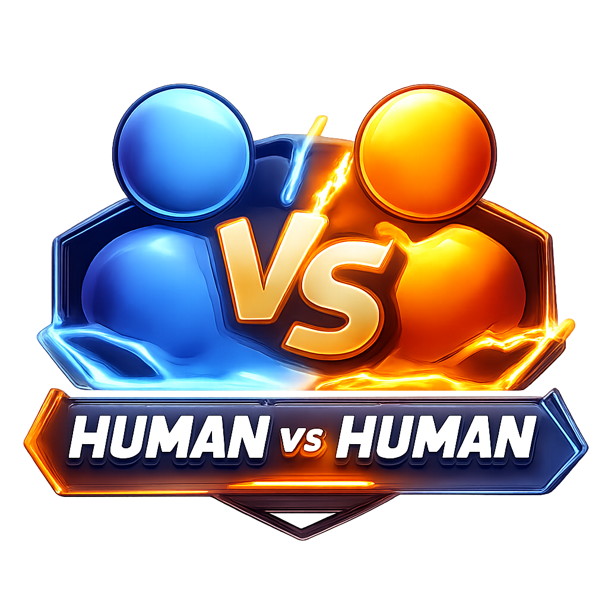

# WordVia - The Colorful Word Game

<div align="center">


**A strategic turn-based word placement game that brings the classic pen-and-paper experience to the digital world.**

[](https://nextjs.org/)
[](https://reactjs.org/)
[](https://www.typescriptlang.org/)
[](https://tailwindcss.com/)

</div>

---

## 📖 About WordVia

WordVia began as a cherished childhood pastime, played with nothing but pen and paper in notebooks. The game was introduced to me by my cousin, **Limon Ahmed**, during my early years learning English as a second language. Though the game never had an official name back then, it fundamentally shaped my lexical resources and turned learning into an engaging challenge.

During the **COVID-19 lockdown**, I reintroduced the game to my younger siblings, **Punno** and **Nourin**, using the same old-fashioned notebooks. Since then, WordVia has become the highlight of every family gathering. Six years have passed, and frankly, the students have surpassed the teacher—they beat me in almost every match!

Inspired by these memories, I decided to evolve the game from the pages of a notebook into a modern web application. I named it **"WordVia"** as a tribute to those childhood afternoons with Limon Bhaia and as a dedication to Punno and Nourin, the two people who loved this game as much as I did.

---

## 🎮 Game Modes

### Human vs Human (PvP)
- **Players**: 2-4 human players
- **Gameplay**: Take turns placing letters on a shared grid
- **Challenge Mode**: Optional mode where players can challenge each other's words



### Human vs Bot (PvB)
- **Players**: 1-3 human players + 1 AI bot
- **Bot Difficulty Levels**:
  - **Easy**: Random valid moves
  - **Medium**: Prioritizes longer words
  - **Hard**: Balances word length and board position
  - **Expert**: Maximum optimization for both length and control
- **Challenge Mode**: Available - Bot automatically provides word meanings when challenged


---

## 📋 Official Game Rules

### 1. Players
- WordVia can be played by **2 to 4 players**
- Currently, all players play on the same device
- Each player enters their name before the game starts

### 2. Game Board
- The game is played on a **square grid**
- Players can choose the grid size at the start: **Minimum 5 × 5**. Larger grids are allowed (up to 10 × 10)
- Each cell can hold only **one letter**

### 3. Turns & Actions
- Players take turns in a fixed order
- On each turn, a player may:
  - Place exactly **one letter** in any empty cell, or
  - **Pass** their turn
- Players may type letters in any order or position, but scoring depends on valid word rules

### 4. Word Formation Rules

A word is considered valid only if **all conditions** below are met:

#### ✅ Direction Rules
Words must read:
- **Left → Right** (horizontal)
- **Top → Bottom** (vertical)

**Not allowed:**
- Right → Left (e.g., XOF for FOX)
- Bottom → Top

#### ✅ Word Length
A valid word must contain at least **2 letters**.

#### ✅ Dictionary Rules
Words must be valid **base-form English words**.

**Not allowed:**
- Proper nouns (names of people, places, brands, companies)
- Plurals ending with "s"
- Verb tenses (ED, ING)
- Abbreviations or slang

**Important**: Once a word has been successfully scored, the **same word cannot be scored again** by any player.

### 5. Scoring System
- A player scores points equal to the **number of letters** in the valid word
- If no valid word is formed after placing a letter, the player scores **0 points** for that turn
- If multiple valid words are formed in one turn, all points are added together

**Example:**
- Player 1 places **O** → No word → 0 points
- Player 2 places **X** next to O → Forms **OX** → 2 points
- Player 1 places **F** to form **FOX** → 3 points

### 6. Word Confirmation (Last-Letter Challenge)
If a player's last placed letter creates **multiple possible valid words**:
- The game will ask the player to confirm which word they intended
- Only words that:
  - Include the last placed letter, and
  - Follow all word rules
- ...will be shown as options
- The selected word is then scored

### 7. End of Game
- Any player may press the **End Game** button at any time
- The game immediately:
  - Stops further turns
  - Totals all players' scores
  - Declares the winner
- The player with the **highest total score wins**
- Ties are allowed

### 8. Fair Play & Strategy
- Repeating previously scored words gives **no points**
- Blocking opponents' future words is a **valid strategy**
- Passing is allowed and sometimes **strategic**

---

## 🎯 Challenge Mode

Challenge Mode adds an extra layer of strategy and verification to the game:

### Features
- **Word meanings are hidden** during gameplay
- Players can **challenge** words created by opponents
- When challenged, the defender must **provide the meaning** of the word
- **AI verification** (via Groq API) checks if the meaning is correct
- Supports meanings in **English or Bengali**

### How It Works
1. Player A creates a word and scores points
2. Player B can click "Challenge This Word!"
3. Player A (defender) must write the meaning
4. AI verifies the meaning using Groq API
5. **If correct**: Player A keeps the points
6. **If wrong**: Player A loses the points

### Bot Challenge Handling
When a bot is challenged:
- Bot automatically fetches the word meaning from:
  1. **COMMON_WORD_DEFINITIONS** (local lexical resource - first priority)
  2. **Dictionary API** (fallback if not in local resources)
- Bot automatically submits the meaning for verification
- Same verification process applies

---

## 🤖 WordVia Bot AI Architecture

The bot uses a **rule-based heuristics system** designed for fast responses (<5 seconds) without external AI/ML dependencies.

### Architecture Overview

```
┌─────────────────────────────────────────────────────────────────┐
│                        BOT TURN TRIGGERED                        │
└─────────────────────────────────────────────────────────────────┘
                                │
                                ▼
┌─────────────────────────────────────────────────────────────────┐
│              STEP 1: IDENTIFY STRATEGIC CELLS                   │
│  • Find empty cells adjacent to existing letters                │
│  • Prioritize cells with more neighboring letters               │
│  • Use center cell if grid is empty                             │
│  • Limited to MAX_CELLS_TO_CHECK (25) for performance          │
└─────────────────────────────────────────────────────────────────┘
                                │
                                ▼
┌─────────────────────────────────────────────────────────────────┐
│              STEP 2: TRY FREQUENT LETTERS                       │
│  • Letters tested: E, A, R, I, O, T, N, S, L, C, D, G           │
│  • These cover ~70% of English word frequency                   │
│  • Tests common letters first for speed                          │
└─────────────────────────────────────────────────────────────────┘
                                │
                                ▼
┌─────────────────────────────────────────────────────────────────┐
│              STEP 3: EXTRACT POSSIBLE WORDS                     │
│  • Get horizontal word containing placed letter                   │
│  • Get vertical word containing placed letter                     │
│  • Extract subwords (for disambiguation)                        │
│  • Filter out already-used words                                 │
└─────────────────────────────────────────────────────────────────┘
                                │
                                ▼
┌─────────────────────────────────────────────────────────────────┐
│              STEP 4: VALIDATE WORDS                             │
│  Priority Order:                                                 │
│  1. COMMON_VALID_WORDS set (instant, local)                      │
│  2. VALID_TWO_LETTER_WORDS set (instant, local)                 │
│  3. Dictionary API (fallback for uncommon words)                 │
└─────────────────────────────────────────────────────────────────┘
                                │
                                ▼
┌─────────────────────────────────────────────────────────────────┐
│              STEP 5: SCORE & SELECT MOVE                        │
│  • Calculate immediateScore (word length)                        │
│  • Calculate boardControlScore (center proximity)                │
│  • Apply difficulty-based weighting                              │
│  • Select best move (with small random variance for variety)     │
└─────────────────────────────────────────────────────────────────┘
                                │
                                ▼
┌─────────────────────────────────────────────────────────────────┐
│                     EXECUTE MOVE OR PASS                        │
└─────────────────────────────────────────────────────────────────┘
```

### Move Generation Pipeline

#### Step 1: Strategic Cell Identification
The bot identifies promising empty cells using `getStrategicCells()`:
- Scans all empty cells on the grid
- Prioritizes cells adjacent to existing letters (more neighbors = higher priority)
- If grid is empty, starts from center position
- Limited to `MAX_CELLS_TO_CHECK` (25) for performance

#### Step 2: Letter Selection
Uses frequency-optimized letter order:
```typescript
const FREQUENT_LETTERS = ['E', 'A', 'R', 'I', 'O', 'T', 'N', 'S', 'L', 'C', 'D', 'G'];
```
These letters appear in ~70% of common English words.

#### Step 3: Word Extraction
For each cell + letter combination:
- **Full Words**: Extract complete horizontal/vertical words containing the letter
- **Subwords**: Extract valid subwords for disambiguation (e.g., placing 'G' after 'DO' creates DOG, but also validates 'OG')
- **Filtering**: Remove words already used in the game

#### Step 4: Dictionary Validation
Three-tier validation system (prioritizes local resources):
1. **Local Two-Letter Set**: 100+ Scrabble-approved 2-letter words (instant)
2. **Common Words Set**: 3000+ frequently used English words with definitions (instant)
3. **API Fallback**: Dictionary API for uncommon words

#### Step 5: Move Scoring & Selection
Each candidate move receives a composite score:

```typescript
immediateScore = wordLength  // Longer words = more points
boardControlScore = distanceFromCenter <= gridSize/3 ? 1 : 0  // Center control bonus
```

### Difficulty Levels

| Difficulty | Behavior | Scoring Formula |
|------------|----------|----------------|
| **Easy** | Random valid move selection | `Math.random() * 10` |
| **Medium** | Prioritizes longer words | `immediateScore * 3` |
| **Hard** | Balances word length + board position | `immediateScore * 3 + boardControlScore * 2` |
| **Expert** | Maximum optimization for both length and control | `immediateScore * 3 + boardControlScore * 2` |

### Disambiguation Handling

When placing a letter creates multiple valid words:
```
Grid: A D O _
Place 'G' → Creates: ADOG (invalid), DOG (valid), OG (valid)
```
The bot:
1. Extracts all possible subwords
2. Validates each against the dictionary
3. Selects the longest valid word
4. Same rules apply as for human players

### Technical Constants

| Constant | Value | Purpose |
|----------|-------|---------|
| `MIN_WORD_LENGTH` | 2 | Minimum valid word length |
| `MAX_CANDIDATES_TO_CHECK` | 20 | Max moves to validate per turn |
| `MAX_CELLS_TO_CHECK` | 25 | Max cells to evaluate |
| `MAX_SUBWORDS_TO_CHECK` | 5 | Max subwords for disambiguation |

### Performance Optimizations

- **Early termination**: Stops searching once enough valid candidates found
- **Letter frequency ordering**: Tests common letters first
- **Local word sets**: Avoids API calls for common words (3000+ words cached)
- **Cell prioritization**: Checks promising cells before random empty cells
- **Parallel validation**: Validates multiple moves simultaneously

---

## 🏗️ Application Architecture

### Tech Stack

- **Framework**: Next.js 14 (App Router)
- **Language**: TypeScript 5
- **UI Library**: React 18
- **Styling**: Tailwind CSS 3
- **UI Components**: shadcn/ui (Radix UI primitives)
- **State Management**: React Context API
- **Word Validation**: Dictionary API + Local Word Sets (COMMON_VALID_WORDS)
- **AI Verification**: Groq API (for challenge mode)
- **Fonts**: Next.js Font Optimization (Inter, Fredoka)

### Project Structure

```
wordia-the-colorful-word-game/
├── app/
│   ├── layout.tsx              # Root layout with fonts and providers
│   ├── page.tsx                 # Home page (game entry point)
│   ├── about/
│   │   └── page.tsx             # About page with game history
│   ├── rules/
│   │   └── page.tsx              # Official game rules
│   ├── not-found.tsx            # 404 page
│   └── api/
│       └── groq/
│           └── verify/
│               └── route.ts    # API route for Groq verification
├── src/
│   ├── components/
│   │   ├── game/
│   │   │   ├── Game.tsx         # Main game wrapper
│   │   │   ├── GameBoard.tsx    # Game board UI and logic
│   │   │   ├── GameSetup.tsx    # Player/mode selection
│   │   │   ├── GameOver.tsx     # End game screen
│   │   │   ├── SplashScreen.tsx # Welcome screen
│   │   │   ├── ModeSelection.tsx # PvP vs PvB selection
│   │   │   ├── ChallengeModal.tsx # Challenge mode UI
│   │   │   ├── WordResultsDisplay.tsx # Word validation results
│   │   │   ├── WordSelectionModal.tsx # Disambiguation modal
│   │   │   ├── DictionaryModal.tsx # Dictionary lookup
│   │   │   └── ui/              # Reusable UI components
│   │   └── HamburgerMenu.tsx    # Navigation menu
│   ├── context/
│   │   └── GameContext.tsx       # Game state management (Context + Reducer)
│   ├── utils/
│   │   ├── botAI.ts             # Bot AI implementation
│   │   ├── wordValidation.ts    # Word validation logic
│   │   └── groqApi.ts            # Groq API client (challenge mode)
│   ├── types/
│   │   ├── game.ts              # TypeScript type definitions
│   │   └── images.d.ts           # Image import declarations
│   └── index.css                 # Global styles
├── public/
│   ├── wordvia-logo.png         # Game logo
│   ├── human-vs-human.png       # PvP mode icon
│   ├── human-vs-robot.png        # PvB mode icon
│   ├── player-*.png             # Player avatars
│   └── *.png                     # Other game assets
├── next.config.js                # Next.js configuration
├── tailwind.config.js            # Tailwind CSS configuration
├── tsconfig.json                 # TypeScript configuration
└── package.json                  # Dependencies and scripts
```

### State Management

The game uses **React Context API** with a **reducer pattern** for state management:

```typescript
GameContext
├── GameState (initial state)
│   ├── players: Player[]
│   ├── grid: Cell[][]
│   ├── currentPlayerIndex: number
│   ├── challengeMode: boolean
│   ├── usedWords: Set<string>
│   └── ...
└── GameReducer
    ├── SETUP_GAME
    ├── PLACE_LETTER
    ├── VALIDATE_WORDS
    ├── NEXT_TURN
    ├── BOT_MOVE
    └── ...
```

### Word Validation System

The word validation system uses a **priority-based approach**:

1. **COMMON_VALID_WORDS** (First Priority)
   - 3000+ common English words
   - Instant validation (no API call)
   - Includes definitions in COMMON_WORD_DEFINITIONS

2. **VALID_TWO_LETTER_WORDS** (Second Priority)
   - 26 valid 2-letter words
   - Instant validation

3. **Dictionary API** (Fallback)
   - Free Dictionary API (dictionaryapi.dev)
   - Used for words not in local sets
   - Results cached for performance

### Challenge Mode Architecture

```
Challenge Flow:
┌─────────────────┐
│ Player Challenges│
│   Opponent's    │
│      Word       │
└────────┬────────┘
         │
         ▼
┌─────────────────┐
│ ChallengeModal  │
│     Opens       │
└────────┬────────┘
         │
         ▼
┌─────────────────┐      ┌──────────────────┐
│ Defender Enters │      │  Bot Defender    │
│    Meaning      │      │  Auto-fetches    │
│  (Human/Bot)    │      │    Meaning       │
└────────┬────────┘      └────────┬─────────┘
         │                        │
         └──────────┬─────────────┘
                    │
                    ▼
         ┌──────────────────┐
         │  Groq API Route   │
         │  (/api/groq/verify)│
         └──────────┬─────────┘
                    │
                    ▼
         ┌──────────────────┐
         │  Groq API Call    │
         │  (Server-side)    │
         └──────────┬─────────┘
                    │
                    ▼
         ┌──────────────────┐
         │  Verification    │
         │  Result          │
         └──────────┬─────────┘
                    │
                    ▼
         ┌──────────────────┐
         │  Points Updated  │
         │  (Keep/Revoke)   │
         └───────────────────┘
```

---

## 🚀 Getting Started

### Prerequisites

- Node.js 18+ or Bun
- npm, yarn, or bun package manager

### Installation

```bash
# Clone the repository
git clone https://github.com/Mahatir-Ahmed-Tusher/wordia-the-colorful-word-game.git

# Navigate to project directory
cd wordia-the-colorful-word-game

# Install dependencies
npm install
# or
bun install
```

### Environment Variables

Create a `.env.local` file in the root directory:

```env
# Groq API Key for Challenge Mode (optional)
# Get your API key from https://console.groq.com/
GROQ_API_KEY=your_groq_api_key_here
```

**Note**: Challenge mode will still work without the API key, but will give benefit of doubt to players on verification errors.

### Development

```bash
# Start development server
npm run dev
# or
bun run dev

# Open http://localhost:3000 in your browser
```

### Production Build

```bash
# Build for production
npm run build

# Start production server
npm start
```

### Linting

```bash
# Run ESLint
npm run lint
```

---

## 🎨 Features

### Core Features
- ✅ **Multiplayer Support**: 2-4 players (PvP) or 1-3 players vs Bot (PvB)
- ✅ **Adjustable Grid Size**: 5×5 to 10×10
- ✅ **AI Bot Opponent**: 4 difficulty levels (Easy, Medium, Hard, Expert)
- ✅ **Challenge Mode**: Verify word meanings with AI (English or Bengali)
- ✅ **Word Validation**: 3000+ common words cached locally + Dictionary API fallback
- ✅ **Disambiguation**: Handle multiple valid words from single letter placement
- ✅ **Dictionary Lookup**: Built-in dictionary for word definitions
- ✅ **Responsive Design**: Works on desktop and mobile devices
- ✅ **Beautiful UI**: Modern glassmorphism design with animations

### Technical Features
- ✅ **Next.js 14**: App Router with Server Components
- ✅ **TypeScript**: Full type safety
- ✅ **Optimized Performance**: Local word caching, parallel validation
- ✅ **SEO Optimized**: Next.js Metadata API
- ✅ **Font Optimization**: Next.js font loading
- ✅ **State Persistence**: localStorage for game state

---

## 📸 Screenshots

### Game Modes Selection
 

### Game Setup


### Gameplay


### Dictionary


---

## 🛠️ Development Details

### Word Validation Priority

The system prioritizes local lexical resources for speed and reliability:

1. **COMMON_VALID_WORDS** (3000+ words)
   - Instant validation
   - Includes definitions
   - No API calls needed

2. **VALID_TWO_LETTER_WORDS** (26 words)
   - Instant validation
   - Scrabble-approved words

3. **Dictionary API** (Fallback)
   - For words not in local sets
   - Results cached automatically

### Bot Meaning Retrieval

When a bot is challenged in Challenge Mode:
1. First checks **COMMON_WORD_DEFINITIONS** (local)
2. Falls back to **Dictionary API** if not found
3. Automatically submits for Groq verification

### API Routes

- `/api/groq/verify` - Server-side Groq API verification
  - Keeps API key secure (server-side only)
  - Handles word meaning verification
  - Supports English and Bengali meanings

---

## 👨‍💻 Developer

**Mahatir Ahmed Tusher**

- 🌐 [GitHub](https://github.com/Mahatir-Ahmed-Tusher)
- 💼 [LinkedIn](https://www.linkedin.com/in/mahatir-ahmed-tusher-5a5524257/)
- 🎓 [Google Scholar](https://scholar.google.com/citations?user=k8hhhx4AAAAJ&hl=en)
- 📧 [Email](mailto:mahatirtusher@gmail.com)

---

## 📝 License

MIT License - feel free to use and modify.

---

## 🙏 Acknowledgments

- **Limon Ahmed** - For introducing me to this wonderful game
- **Punno & Nourin** - For keeping the game alive and making it better
- **Dictionary API** - Free dictionary service (dictionaryapi.dev)
- **Groq** - Fast AI inference for challenge verification

---

## 🎯 Future Enhancements

- [ ] Online multiplayer support
- [ ] Mobile app version
- [ ] Additional languages support
- [ ] Tournament mode
- [ ] Statistics and leaderboards
- [ ] Custom word lists
- [ ] Theme customization

---

<div align="center">

**Made with ❤️ for word game enthusiasts**


</div>
